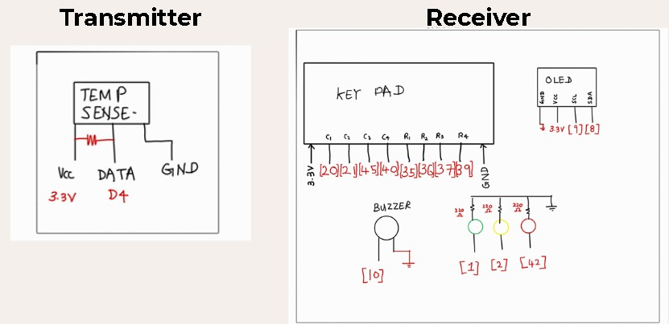
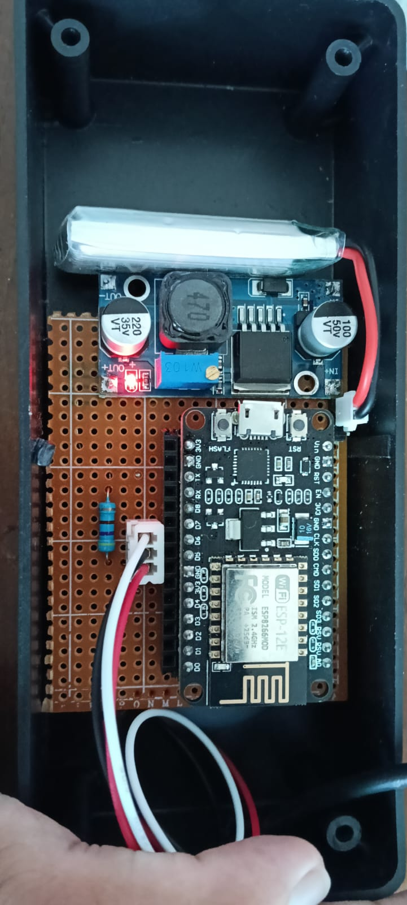
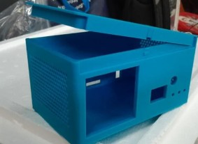
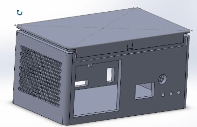
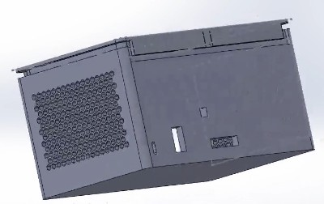
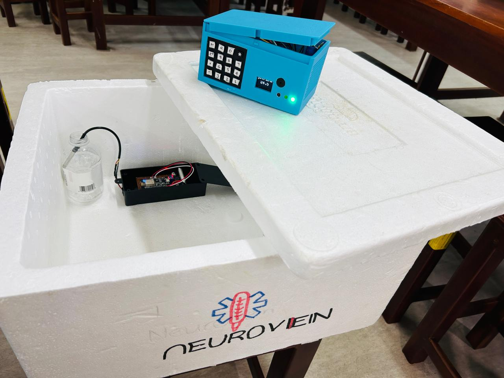

# Smart Vaccine Temperature Monitoring System

A portable, low-cost vaccine temperature monitoring system designed for cold-chain transport in rural and low-resource settings.  
The system provides real-time temperature monitoring, configurable safety thresholds, and wireless alerts using ESP-NOW communication.

---

## 1. Overview

Vaccines must be maintained within a strict temperature range (typically 2–8°C) to preserve potency. During transportation(especially in rural outreach) temperature excursions may go undetected, leading to vaccine spoilage and wastage.

This project presents a smart monitoring solution that:

- Continuously measures internal temperature
- Wirelessly transmits data without Wi-Fi infrastructure
- Provides visual and audio alerts for temperature excursions
- Allows configurable temperature thresholds
- Operates on rechargeable battery power

The system is designed to be affordable, modular, and suitable for low-resource healthcare environments.

---

## 2. System Architecture

The system consists of two main subsystems:

### Transmitter Unit (Inside Vaccine Box)
- ESP8266 NodeMCU
- DS18B20 Digital Temperature Sensor
- Battery-powered
- Sends temperature data via ESP-NOW

### Receiver Unit (External Monitoring Module)
- ESP32-S3
- 0.96" OLED Display
- 4x4 Keypad for threshold configuration
- LED indicators (Safe / Warning / No Data)
- Active buzzer for alerts
- Receives data via ESP-NOW

### Communication Protocol
- ESP-NOW (peer-to-peer wireless protocol)
- No internet or router required
- Low-latency and energy-efficient

---

## 3. Key Features

- Real-time temperature monitoring
- Configurable upper and lower thresholds
- OLED live temperature display
- LED status indicators:
  - Green → Within safe range
  - Red (blinking) → Temperature excursion
  - Yellow → No data received
- Audible buzzer alerts
- Automatic timeout detection
- Battery-powered operation
- Designed for future Peltier cooling integration

---

## 4. Hardware Components

### Core Electronics
- ESP8266 NodeMCU (Transmitter)
- ESP32-S3 (Receiver)
- DS18B20 Waterproof Digital Temperature Sensor
- 0.96” OLED Display (I2C)
- 4x4 Matrix Keypad
- Active Buzzer
- LED Indicators
- 18650 Li-ion Battery
- Boost Converter Module

### Enclosure
- Insulated vaccine compartment
- Receiver housing with display and keypad
- Provision for future Peltier module integration

---

## 5. Firmware Architecture

### Transmitter Firmware (ESP8266)

Responsibilities:
- Initialize DS18B20 sensor
- Read temperature every 1 second
- Package data into structured format
- Transmit via ESP-NOW
- Handle sensor disconnection errors

Core logic:
- OneWire + DallasTemperature library
- ESP-NOW peer configuration
- Periodic data transmission

---

### Receiver Firmware (ESP32-S3)

Responsibilities:
- Receive temperature data via ESP-NOW callback
- Store latest reading
- Compare against user-defined thresholds
- Control buzzer and LED indicators
- Display temperature and limits on OLED
- Handle timeout detection (no data condition)
- Allow threshold input via keypad

Key Embedded Concepts Used:
- Interrupt-driven callback for wireless reception
- State-based LED logic
- Non-blocking buzzer toggling using millis()
- Timeout monitoring for communication reliability

---

## 6. Threshold Configuration

Users can enter threshold-setting mode using the keypad:

- Lower threshold input
- Upper threshold input
- Automatic correction if upper < lower
- Real-time display update

This allows flexibility for different vaccine temperature requirements.

---

## 7. Testing and Validation

The prototype was evaluated under lab and field-like conditions.

### Results

- Wireless range: 20–30 meters (line-of-sight)
- Sensor accuracy deviation: approximately ±0.5°C (compared to calibrated thermometer)
- Reliable threshold detection and alert triggering
- Stable OLED readout
- Sufficient battery performance for continuous monitoring

---

## 8. Regulatory Considerations

The device is intended as a low-risk monitoring accessory for vaccine cold-chain systems.

Likely classification:
- Class I (low-risk monitoring device)

Relevant standards considered:
- IEC 60601 (Electrical safety considerations)
- IEC 62304 (Medical device software lifecycle)
- WHO cold-chain guidelines
- Local Ministry of Health compliance requirements

Future iterations would require:
- Sensor validation testing
- Electrical safety compliance
- EMC testing
- Software documentation per medical device standards

---

## 9. Hardware Overview

### Circuit Diagram

### Block Diagram

### PCB Layout

### Enclosure Design

### Final product Assembly

---

## 10. Future Improvements

- Integration of Peltier-based active cooling
- Multi-sensor internal thermal mapping
- Solar charging module for remote deployment
- Cloud-based data logging
- Fault detection for sensor and communication errors
- Improved insulation materials
- Secure encrypted ESP-NOW transmission

---

## 11. Budget Summary

Total prototype cost: ~8410 LKR

Major cost contributors:
- ESP32-S3
- Enclosure materials
- Insulated structure
- Battery system

The system was designed to remain affordable for low-resource healthcare settings.

---

## 12. Contributors
- Colombage DM (me)– Circuit design, algorithm development, PCB soldering
- Abdul Rahman – Wireless communication configuration, enclosure design
- Abishek L – Mobile application development
- Suresh S – Documentation

University of Moratuwa  
Department of Electronic & Telecommunication Engineering  
BM2210 – Biomedical Device Design

---

## 13. License

This project is released under the MIT License.

---

## 14. Disclaimer

This project is a prototype developed for academic purposes.  
It is not certified for clinical or commercial medical use.  
Further validation and regulatory approval would be required for real-world deployment.

